# CLI-matic

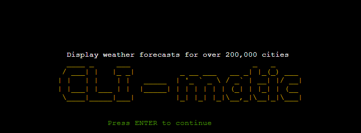

CLI-matic is a Python command line tool for displaying weather forecasts. It requests data by making an API call to the [Open Weather Map](https://openweathermap.org/api) service provider using Python's [requests](https://requests.readthedocs.io/en/latest/) library. The interface is very simple. The user is navigated by specific and simple instructions. Weather forecasts are also displayed in a table using Python's [rich](https://rich.readthedocs.io/en/stable/introduction.html#:~:text=Rich%20is%20a%20Python%20library,in%20a%20more%20readable%20way.) library.

## Contents

- [CLI-matic](#cli-matic)
  - [Contents](#contents)
  - [Objective](#objective)
  - [User Experience](#user-experience)
  - [Data Model](#data-model)
  - [Design](#design)
    - [ASCII Art](#ascii-art)
    - [Colors](#colors)
  - [Existing Features](#existing-features)
    - [Home screen](#home-screen)
    - [Main Menu](#main-menu)
    - [Forecast Menu](#forecast-menu)
    - [City Entry](#city-entry)
    - [Select City](#select-city)
    - [Current Weather Forecast](#current-weather-forecast)
    - [Daily Weather Forecasts at 3-hour Intervals](#daily-weather-forecasts-at-3-hour-intervals)
    - [Exit](#exit)
  - [Future Features](#future-features)
  - [Technologies Used](#technologies-used)
  - [Python Libraries](#python-libraries)
  - [Testing](#testing)
    - [PEP8 Validation](#pep8-validation)
    - [Manual Testing](#manual-testing)
  - [Bugs](#bugs)
    - [Bugs Fixed](#bugs-fixed)
    - [Bugs Unfixed](#bugs-unfixed)
  - [Deployment](#deployment)
    - [Clone Repository](#clone-repository)
    - [Heroku Deployment](#heroku-deployment)
  - [Credits](#credits)
    - [Code](#code)
    - [Acknowledgments](#acknowledgments)

## Objective

The primary goal of the project is to develop a simple mock terminal application using the Python programming language. In addition, one of the most important purposes of the application is to request data from service providers using API and to display this data on the screen in a format that the user can read.

You can view the live site here - [CLI-matic](https://cli-matic.herokuapp.com/)

[Back to top](<#contents>)

## User Experience

The repository used to develop the application is a Node.js mock terminal application prepared by Code Institute. Since this project was developed as part of the Code Institute education, no changes were necessary to the appearance of the application in the browser. But to make the terminal look a little more user friendly, some Python libraries/modules are used for coloring texts, creating tables and presenting content.

Here are some user experience criteria that were considered while developing the application:

- As a user, I would like to see a simple interface.
- As a user, I don't want to read too much content.
- As a user, I would like to see the weather forecast of the city I am looking for in a proper format.
- As a user, I would like to see clear navigation.
- As a user, I don't want to enter too many inputs to use the app.

The application has been developed considering the above criteria.

[Back to top](<#contents>)

## Data Model

CLI-matic requests all data from the Open Weather Map service provider. Data requests are made in 3 different ways.

- Request for gzip file with city names
- Requesting city coordinates with the Geolocation API
- Requesting current weather data and 3 hourly daily weather data with the OWM API

There is no need to make an API call to request data with city names. In order to receive this data, an HTTPS request was made with the Python request library. Since the requested data is in gzip format, the data was first saved as a gzip file. Then, with the 'with' statement and open() function, the city name was taken from the data and appended to the city list variable. The city name entered by the user is checked from this list and its validity is determined.

After the city name is validated, the name of the city is passed to the URL of the Geocoding API and the data about this city is requested with an API call. The latitude and longitude of the city were taken from the requested data and assigned to the latitude and longitude variables globally. Since the latitude and longitude fetched after the Geocoding API call, this data will be used to request weather forecast data and these variables will be called from another function, so the variables are globalized.

Finally, the fetched latitude and longitude data are passed to the URL that will be used in the API call from which weather forecast data will be requested. The data fetched from weather forecast API call is filtered with a very simple 'Weather' class, and the data to be displayed is presented in a table using the rich library.

Below is a simple flowchart showing the data flow.

CLI-matic Flowchart

[Back to top](<#contents>)

## Design

Since this is a command line tool, what can be done in terms of design is very limited. Therefore, ASCII characters were created and the text content was colored.

### ASCII Art

The ASCII characters seen on the screens at the beginning of the application and after the program is exited are created using the [pyfiglet](https://pypi.org/project/pyfiglet/0.7/) library.

### Colors

The [termcolor](https://pypi.org/project/termcolor/) library was used to color the contents.

[Back to top](<#contents>)

## Existing Features

### Home screen

It is the first screen that the user sees when the application is opened. On this screen, the name of the application is printed as a banner with ASCII characters and the user is asked to press ENTER to continue.

Home Screen Screenshot

 

[Back to top](<#contents>)

### Main Menu

On this screen, the user is greeted and a brief information about the application is given. In addition, the user is presented with options for navigation.

Main Menu Screenshot

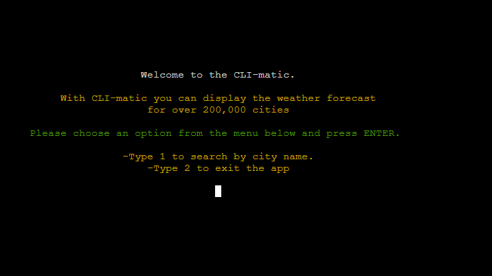

 

[Back to top](<#contents>)

### Forecast Menu

On this screen, the user is presented with 3 different options. Two of them are what type of weather forecast the user wants to display, and the last one is whether the user wants to return to the main menu.

Forecast Menu Screenshot

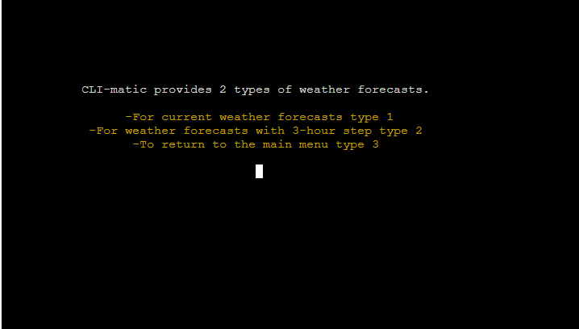

 

[Back to top](<#contents>)

### City Entry

On this screen, the user is asked to enter the name of the city for which the user wants to see the weather forecasts.

City Entry Screenshot

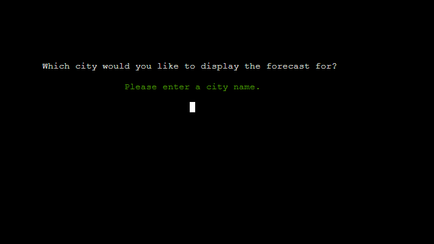

 

[Back to top](<#contents>)

### Select City

More than 1 result can be fetched for the desired city name. (for instance, London in the UK and London in the US). In such a case, the user is asked which city the user wants data to be displayed. The data is displayed in line with the answer given by the user.

Select City Screenshot

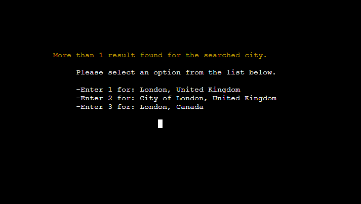

 

[Back to top](<#contents>)

### Current Weather Forecast

On this screen, the current weather forecasts for the asked city are displayed in a table. Below the table, 3 different navigation options are presented to the user. According to the user's selection, the relevant screen is returned.

Current Weather Forecast Screenshot

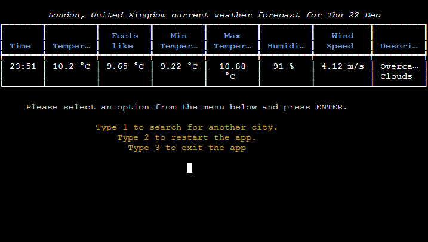

 

[Back to top](<#contents>)

### Daily Weather Forecasts at 3-hour Intervals

On this screen, daily weather forecasts are displayed at 3-hour intervals. As in the current weather forecasts screen, 3 different navigation options are presented to the user here, too.

Daily Weather Forecasts at 3-hour Intervals Screenshot

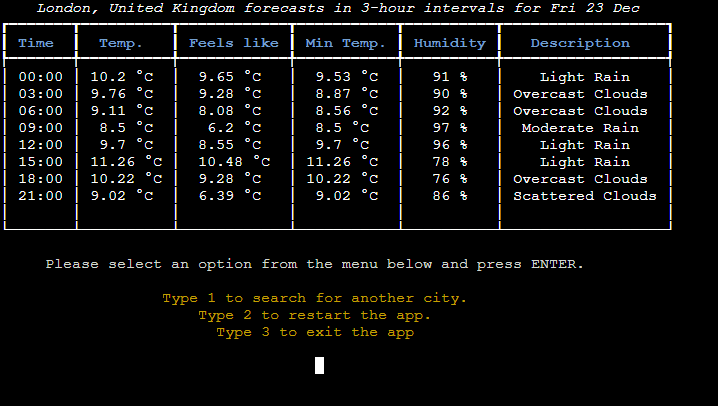

 

[Back to top](<#contents>)

### Exit

This is the screen where the program is terminated. On this screen, the user is greeted and given the necessary information to re-run the application.

Exit Screenshot

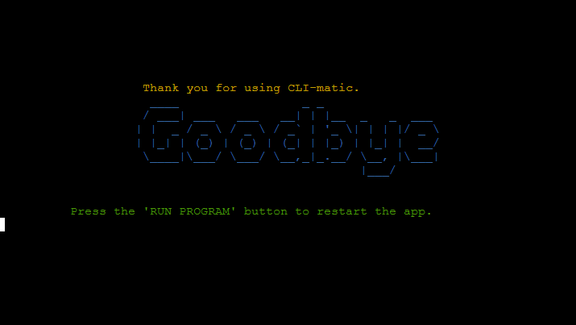

 

[Back to top](<#contents>)

## Future Features

- It will be an effective and useful option to determine the location of the user using the application and quickly show the weather forecasts for the location of the user.

- The application uses the free option of OWM. Therefore, a limited number of options are offered. Offering more comprehensive weather forecasts will increase user diversity.

- Showing images/emojis according to the weather conditions on the screen where the weather forecasts are displayed can make the application more attractive.

[Back to top](<#contents>)

## Technologies Used

- [HTML5](https://en.wikipedia.org/wiki/HTML) - Used for structuring and presenting content on the website.
- [CSS3](https://en.wikipedia.org/wiki/CSS) - Used for styling the website.
- [Python](https://en.wikipedia.org/wiki/Python_(programming_language)) - Used to provide the functionality of the application.
- [VSCode](https://code.visualstudio.com/) - Used to create and edit the application.
- [Git](https://en.wikipedia.org/wiki/Bash_(Unix_shell)) - Used as version control system to track changes in development process.
- [GitHub](https://github.com/) - Used to host the project's files and folders.
- [Heroku](https://www.heroku.com/) - Used to deploy the project
- [Draw.io](https://marketplace.visualstudio.com/items?itemName=hediet.vscode-drawio) - Used to make flowchart of the application.

[Back to top](<#contents>)

## Python Libraries

The following Python libraries were used in the development of the project.

- [requests](https://requests.readthedocs.io/en/latest/) - Used to request data.
- [pyfiglet](https://pypi.org/project/pyfiglet/0.7/) - Used to create ASCII texts.
- [termcolor](https://pypi.org/project/termcolor/) - Used to color text.
- [rich](https://rich.readthedocs.io/en/stable/introduction.html#:~:text=Rich%20is%20a%20Python%20library,in%20a%20more%20readable%20way.) - Used to display weather forecasts in a table.
- [country-converter](https://pypi.org/project/country-converter/0.3.1/) - Used to convert country codes into names.
- [os](https://docs.python.org/3/library/os.html) - Used to provide a way to use OS dependent functionality (e.g; cleaning the terminal screen).
- [json](https://docs.python.org/3/library/json.html) - Used to convert file object to JSON object.
- [datetime](https://docs.python.org/3/library/datetime.html) - Used to convert timestamp to human-readable/formatted string.
- [gzip](https://docs.python.org/3/library/gzip.html) - Used to decompress gzip file.

[Back to top](<#contents>)

## Testing

### PEP8 Validation

Validation tests were performed using the [CI Python Linter](https://pep8ci.herokuapp.com/) provided by the Code Institute. Errors that emerged as a result of the tests have been corrected and screenshots of the error free testing have been taken. 

run.py Testing Screenshot

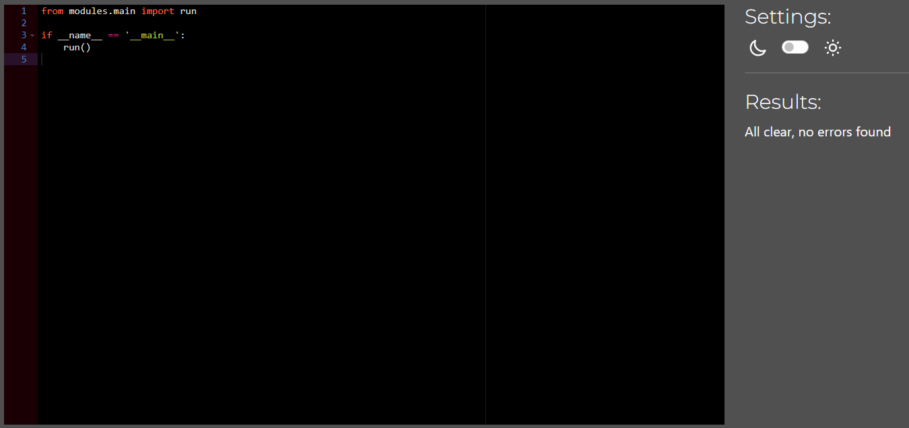

 

main.py Testing Screenshot

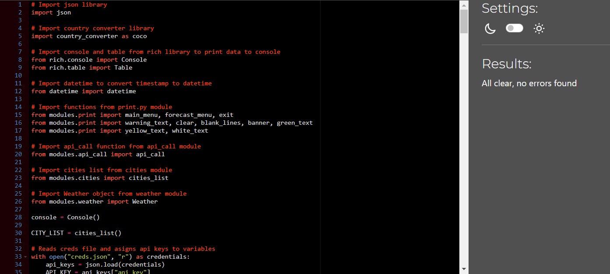

 

print.py Testing Screenshot

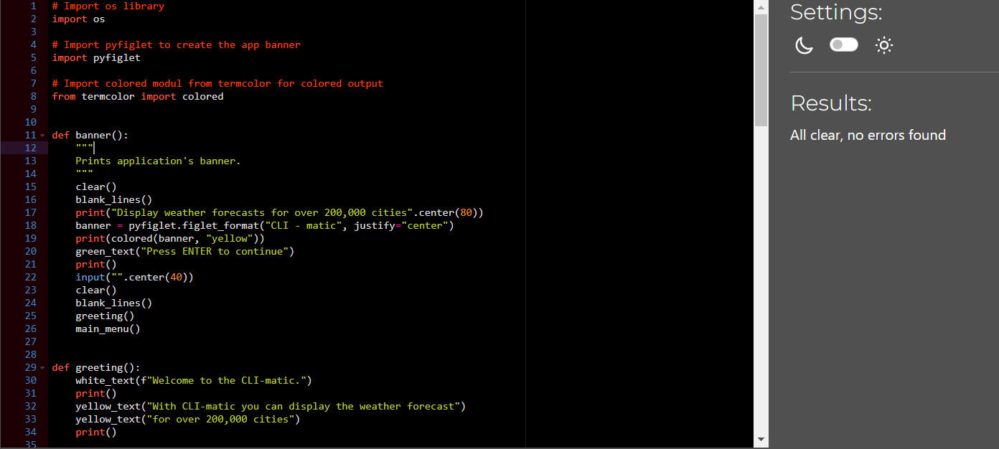

 

cities.py Testing Screenshot

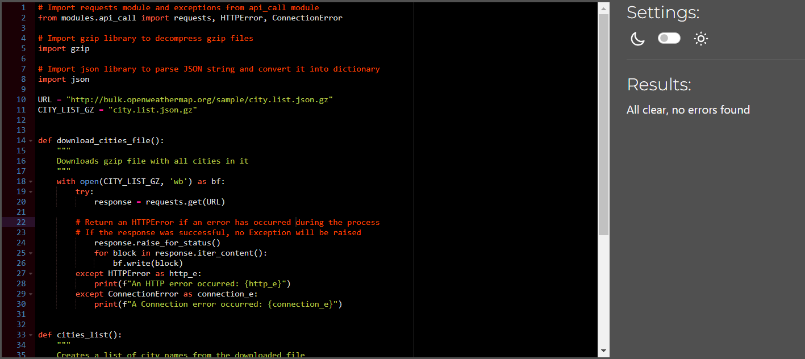

 

api_call.py Testing Screenshot

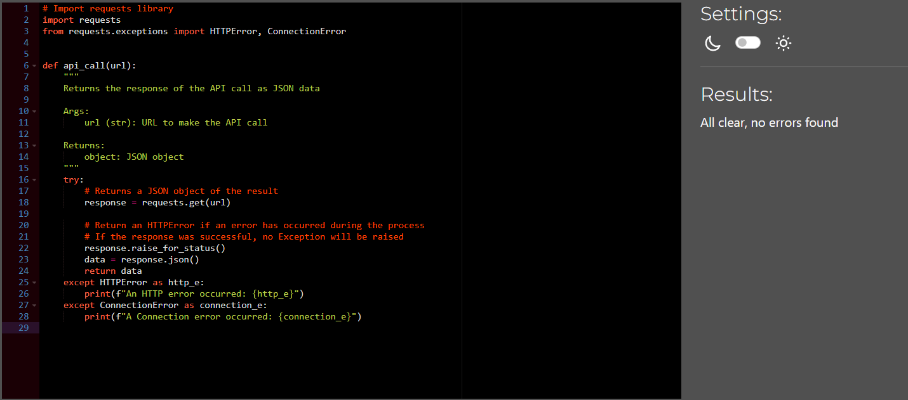

 

weather.py Testing Screenshot

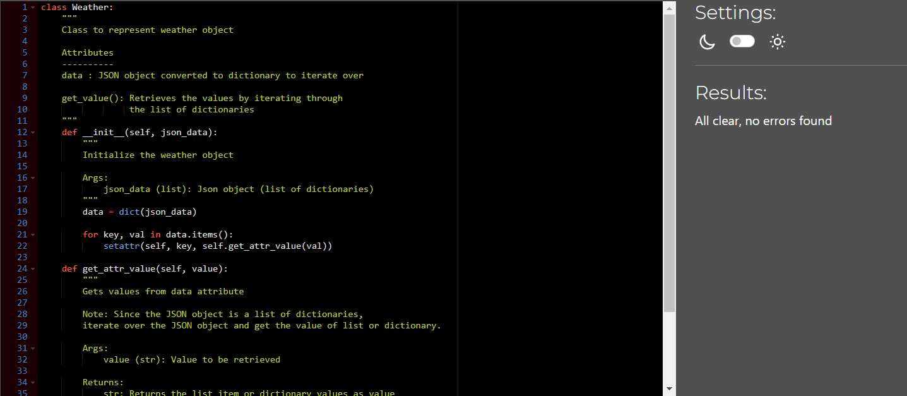

 

[Back to top](<#contents>)

### Manual Testing

Based on the data model shown in the flowchart, manual tests were carried out with different inputs. Invalid/valid inputs were tried for validation tests and all validation tests were successful.

[Back to top](<#contents>)

## Bugs

### Bugs Fixed

A number of minor bugs were encountered during the development phase, and all bugs have been fixed. These bugs were often caused by incorrect statement usage or carelessly written validation code for user input. A single major bug was found to be reported here, which caused the content of the app to change. Details on this are in the Bugs Unfixed section.

[Back to top](<#contents>)

### Bugs Unfixed

While developing the application, an API that determines the user's location is used. This API was able to find the user's location from the user's IP address and get location data. However, after the application was deployed to Heroku, Dublin always appeared as the current location. The reason the IP geolocation API always shows Dublin as the current location because the Heroku server is in Dublin. After researching about it for a long time and trying various methods, I emailed Matt, Senior Product Developer at Code Institute, who created the GitHub repo we use for this project, and in line with his reply, I removed this feature from the application because I knew that I could not solve this problem with my current programming knowledge.

[Back to top](<#contents>)

## Deployment

### Clone Repository

The project started to be developed by cloning the mock terminal repository provided by the Code Institute. The cloning phase of the project is as follows:

- Go to the[GitHub repository](https://github.com/Code-Institute-Org/python-essentials-template) to be cloned. Click the 'Use this template' text and and then click 'Create a new repository' in the dropdown menu that opens.

    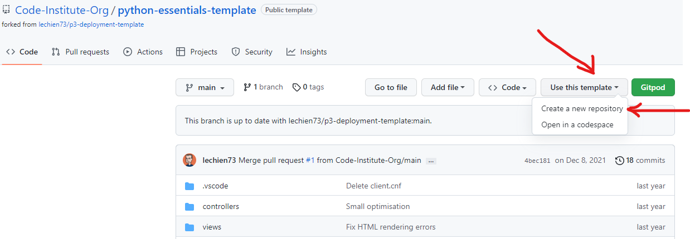

- The following image will open on a new page. After specifying the repository name, you can create the repository without writing a description. The new repository will be created automatically.

    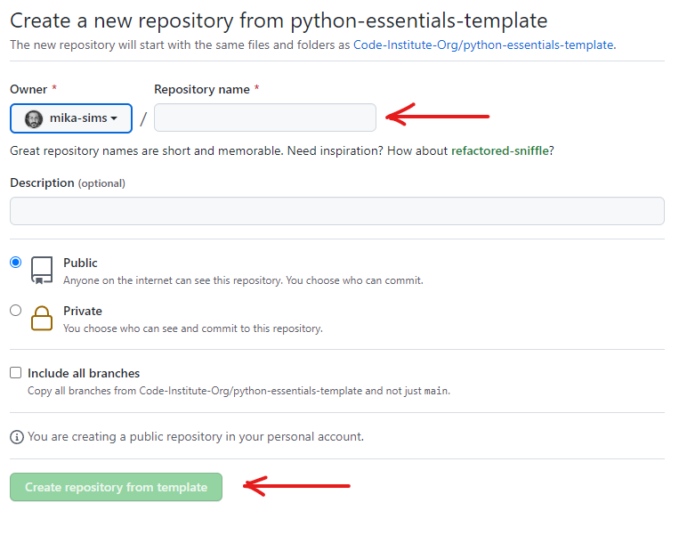

- Then, if you want, you can open with the GitPod or clone it to your computer and work on locally. Since I am running locally, I will explain how I cloned it to the computer. As in the first step, we press the 'Code' button, open the dropdown menu and copy the link indicated by the arrow.

    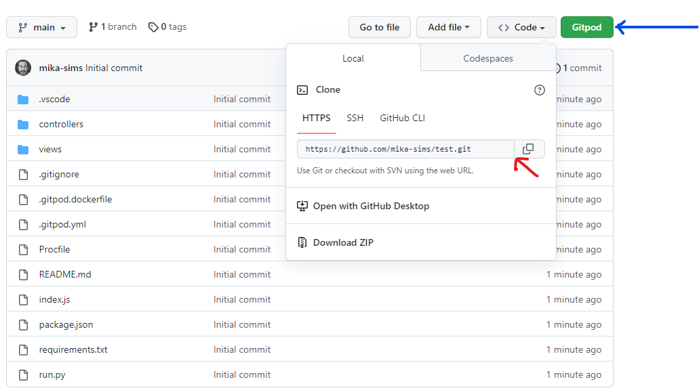

- Then, we open the terminal application we use from the computer and clone the repository to our computer with the 'git clone -link to be cloned-' command. Then you can develope your work using the source-code editor of your choice.

    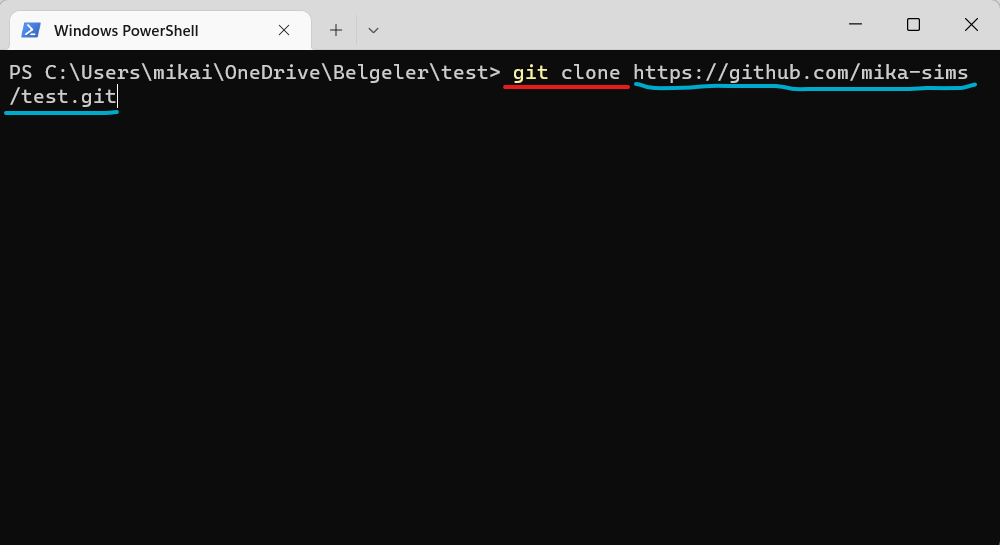

    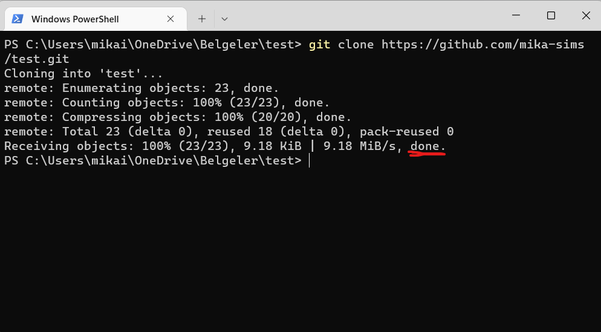

[Back to top](<#contents>)

### Heroku Deployment

- After the project is completed, we open the Heroku dashboard and create a new app by pressing the 'New' button in the upper right corner.

    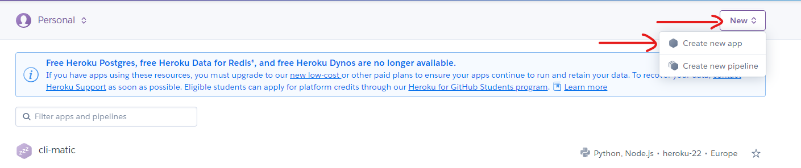

- Then we determine the name of the application and create our application.

    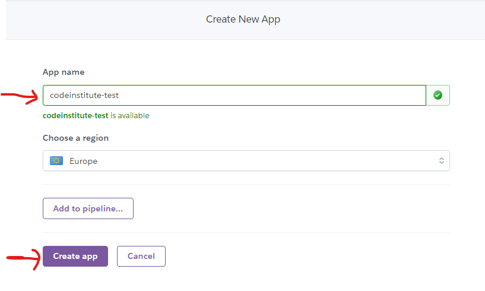

- At this stage, the first thing we need to do is to connect Heroku and GitHub repository. When we click on the GitHub logo indicated by the arrow, we will be linked to our GitHub account. We connect with Heroku by typing the name of the repository.

    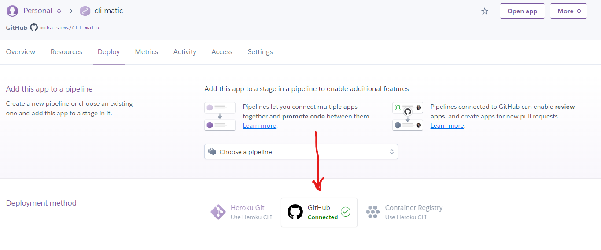

    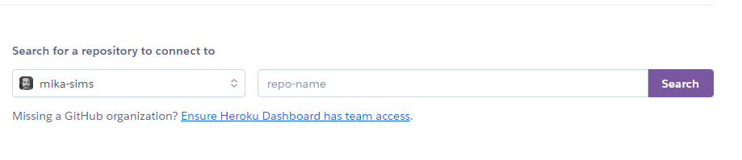

- Then we go to the 'Settings' section in the menu bar. Here, we first click on the 'Reveal Config Vars' button and add our credentials here, if any.

    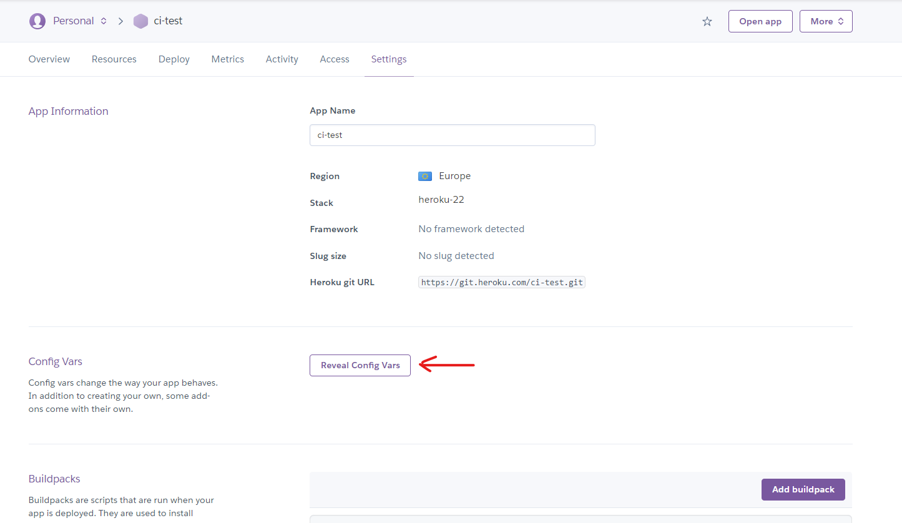

    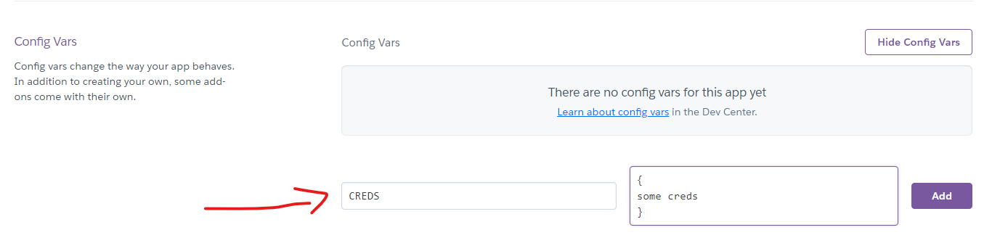

- Then we click the 'Add buildpack' button and add the Node.js used while creating the application page and the Python we use in our application to the buildpack.

    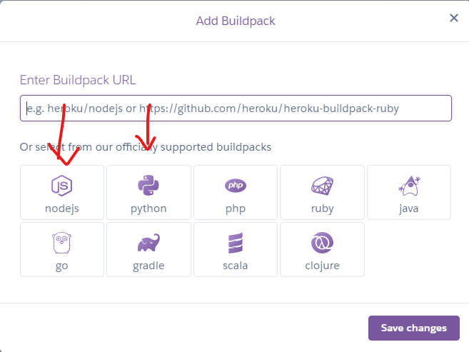
    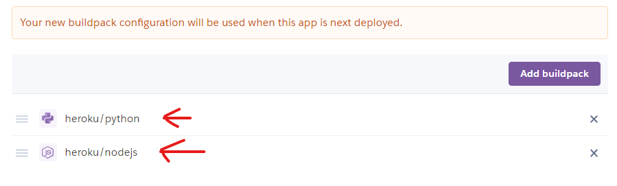

- After this point, we go to the 'Deploy' section of the menu and press the 'Deploy Branch' button and deploy our project.

    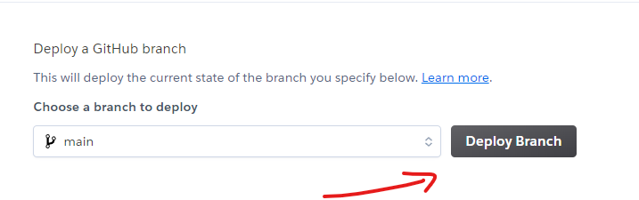

[Back to top](<#contents>)
## Credits

### Code

- While researching how I can use the Python class in the API call, a content I came across on StackOverflow allowed me to create the Weather class in the weather.py file. I can't share the link here because I couldn't find the link that I didn't record because of my carelessness at that time.

- While browsing the projects on the Student Projects page of Code Institute, I saw that [Fiona Tracey](https://github.com/Fiona-T) used pyfiglet to create ASCII text and termcolor to color the text in her project. That's why I decided to use these libraries.

[Back to top](<#contents>)

### Acknowledgments

- Thanks to Code Institute for the repository provided to us so that we can create the project,

- Thanks to my mentor, Precious Ijege, whose comments made me develop this project in a more convenient way,

- Thanks to the Code Institute slack community

- Thanks to everyone at Code Institute for their help and support.

[Back to top](<#contents>)